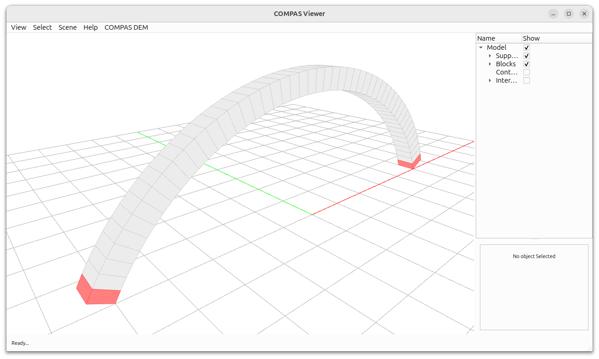

********************************************************************************
DEM Data Structure: Overview
********************************************************************************

.. rst-class:: lead

A concise, step-by-step overview that builds a small block model from a template,
computes contacts, inspects element data (centroids, vertices), applies a transformation,
adds an interaction, converts meshes to BREP, and visualizes everything.

Contents
--------

1. `Data`_: instantiate an :class:`compas_dem.templates.ArchTemplate` to generate simple block meshes.
2. `Model`_: create a :class:`compas_dem.models.BlockModel` and add blocks via :meth:`compas_dem.elements.Block.from_mesh`.
3. `Supports`_: set fixed elements.
4. `Transformation`_: assign a transformation matrix to one element to move it.
5. `Centroids`_: query element geometry centroids for each block.
6. `Vertices`_: iterate element geometry vertices and read vertex coordinates.
7. `Contacts`_: call :meth:`compas_dem.models.BlockModel.compute_contacts` then iterate :meth:`compas_dem.models.BlockModel.contacts`.
8. `Interaction`_: connect two elements via :meth:`compas_dem.models.BlockModel.add_interaction`.
9. `Mesh to Brep`_: convert meshes to Brep geometry using COMPAS functions.
10. `Visualization`_: use :class:`compas_dem.viewer.DEMViewer` to add model groups (supports, blocks, contacts, interactions) and overlay centroids/vertices/BREPs.

Imports
^^^^^^^

.. literalinclude:: dem_datastructure_overview.py
    :language: python
    :end-before: # Data

Data
^^^^

A model is created from a collection of solid Mesh or BRep objects. Most vault and arch topologies are written as templates to automate the geometry generation process. In this tutorial, we use the :class:`compas_dem.templates.ArchTemplate` to generate a vault topology.

.. literalinclude:: dem_datastructure_overview.py
    :language: python
    :start-after: # Data
    :end-before: # Model

   Arch template.

.. tip::
   You can also load geometry from an obj file:

.. code-block:: python

    from compas.files import OBJ
    import pathlib

    PATH = pathlib.Path(__file__).parent.parent.parent / "data" /
    FILE = "wall.obj"

    obj = OBJ(PATH / FILE)
    obj.read()

    meshes = []
    for name in obj.objects:
        vertices, faces = obj.objects[name]
        mesh: Mesh = Mesh.from_vertices_and_faces(vertices, faces)
        mesh.scale(2, 2, 2)
        mesh.name = name
        meshes.append(mesh)

Model
^^^^^

Then we create a :class:`compas_dem.models.BlockModel` and add blocks via :meth:`compas_dem.elements.Block.from_mesh`. The :class:`compas_dem.models.BlockModel` class represents a general model of hierarchically organized elements with interactions. It contains additional data structures such as a tree and a graph. At this step, the model and initial geometry are the same.

.. literalinclude:: dem_datastructure_overview.py
    :language: python
    :start-after: # Model
    :end-before: # Supports

.. tip::
   Check constructor overloads of :class:`compas_dem.elements.Block` to create blocks from different geometries.

.. code-block:: python

    Block.from_box()
    Block.from_mesh()
    Block.from_brep()

.. tip::
   Check constructor overloads of :class:`compas_dem.models.BlockModel` to create models from various templates.

.. code-block:: python

    BlockModel.from_arch()
    BlockModel.from_barrelvault()
    BlockModel.from_crossvault()
    BlockModel.from_fanvault()
    BlockModel.from_pavilionvault()
    BlockModel.from_triangulation_dual()
    BlockModel.from_meshpattern()

Supports
^^^^^^^^

Elements are fixed by assigning the boolean atribute of the support.

.. literalinclude:: dem_datastructure_overview.py
    :language: python
    :start-after: # Supports
    :end-before: # Transformation

   Supports.

Transformation
^^^^^^^^^^^^^^

When we assign the transformation matrix to an element, we can change its orientation. If a tree hierarchy is used, the transformations will affect the sub-elements.

.. literalinclude:: dem_datastructure_overview.py
    :language: python
    :start-after: # Transformation
    :end-before: # Centroids

.. figure:: ../_images/dem_datastructure_overview_transformation.png
   :align: center

   Transformed block.

Centroids
^^^^^^^^^

We can get the centroids of the blocks:

.. literalinclude:: dem_datastructure_overview.py
    :language: python
    :start-after: # Centroids
    :end-before: # Vertices

.. figure:: ../_images/dem_datastructure_overview_centroids.png
   :align: center

   Centroids.

Vertices
^^^^^^^^

We can extract vertices and faces, where vertices are stored as a list of 3 floats and faces are stored as a list of 3 or n integers.

.. literalinclude:: dem_datastructure_overview.py
    :language: python
    :start-after: # Vertices
    :end-before: # Contacts

.. figure:: ../_images/dem_datastructure_overview_vertices.png
   :align: center

   Vertices.

Contacts
^^^^^^^^

We can compute contacts between blocks using the :meth:`compas_dem.models.BlockModel.compute_contacts` method. Contacts are stored as a list of contact objects. The detected contacts are highlighted in light blue color and stored as polygons. We can access the contact polygon by iterating :meth:`compas_dem.models.BlockModel.contacts` and accessing the polygon attribute.

.. literalinclude:: dem_datastructure_overview.py
    :language: python
    :start-after: # Contacts
    :end-before: # Interaction

   Contacts.

When contacts are detected, the interaction graph displays the connectivity of the elements by lines drawn from the centroids of blocks.

.. figure:: ../_images/dem_datastructure_overview_graph.png
   :align: center

   Graph edges.

Interaction
^^^^^^^^^^^

While contacts are specific interactions between blocks, interactions are more general and can be used to connect any two elements. By calling the :meth:`compas_dem.models.BlockModel.add_interaction` function, we add an edge to the model graph. Optionally, we can specify a modifier class to define how the second element is modified by the first element. Most often, we use modifiers to define solid Boolean operations between meshes or breps.

.. literalinclude:: dem_datastructure_overview.py
    :language: python
    :start-after: # Interaction
    :end-before: # Visualization

.. figure:: ../_images/dem_datastructure_overview_interaction.png
   :align: center

   Interaction.

Mesh to Brep
^^^^^^^^^^^^

For using BRep outside Rhino, please insteal compas_occ package and import Brep from compas_occ.geometry. We can convert meshes to breps using COMPAS geometry functions. Breps are stored as a list of Brep objects. Or if we start from breps, we convert them to meshes by extracting polygons from brep faces.

.. code-block:: python

    from compas.geometry import Brep
    breps = []
    for el in elements:
        brep = Brep.from_mesh(el.modelgeometry)
        breps.append(brep)
        # polygons = brep.to_polygons()
        # mesh = Mesh.from_polygons(polygons)

Visualization
^^^^^^^^^^^^^

We can visualize the model using the :class:`compas_dem.viewer.DEMViewer` class. The viewer adds model groups (supports, blocks, contacts, interactions) on the left side of the screen. At the top of the screen, there is an additional button called "COMPAS_DEM" with options: "Show Blocks", "Show Contacts", and "Show Interactions". 

.. literalinclude:: dem_datastructure_overview.py
    :language: python
    :start-after: # Visualization
