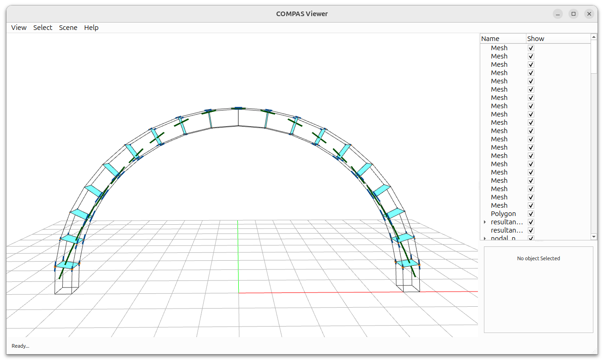

********************************************************************************
DEM Data Structure: Results
********************************************************************************

.. rst-class:: lead

A practical guide to add results from DEM analysis to the data structure for visualization.
Learn how to load analysis results and visualize force vectors on contact interfaces.

   DEM model with analysis results showing force vectors on contact interfaces.

Contents
--------

1. `Model Setup`_: create a :class:`compas_dem.models.BlockModel` and compute contacts.
2. `Load Results`_: import analysis results from JSON file.
3. `Store Results`_: attach force data to contact objects.
4. `Visualization`_: display elements, contacts, and force vectors with different colors.

Model Setup
^^^^^^^^^^^

Create a model from an :class:`compas_dem.templates.ArchTemplate` and compute contacts to establish the foundation for result visualization.

.. literalinclude:: dem_datastructure_results.py
    :language: python
    :start-after: # Model
    :end-before: # Load results

Load Results
^^^^^^^^^^^^

Load analysis results from a JSON file containing force data for each contact interface.

.. literalinclude:: dem_datastructure_results.py
    :language: python
    :start-after: # Load results
    :end-before: # Store results in contacts

Store Results
^^^^^^^^^^^^^

Attach the loaded force data to each contact object for easy access during visualization.

.. literalinclude:: dem_datastructure_results.py
    :language: python
    :start-after: # Store results in contacts
    :end-before: # Visualization

Visualization
^^^^^^^^^^^^^

Visualize the model with elements, contact polygons, and force vectors using different colors and line widths to distinguish force types.

.. literalinclude:: dem_datastructure_results.py
    :language: python
    :start-after: # Visualization

